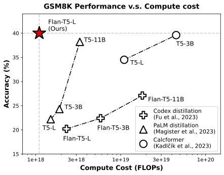
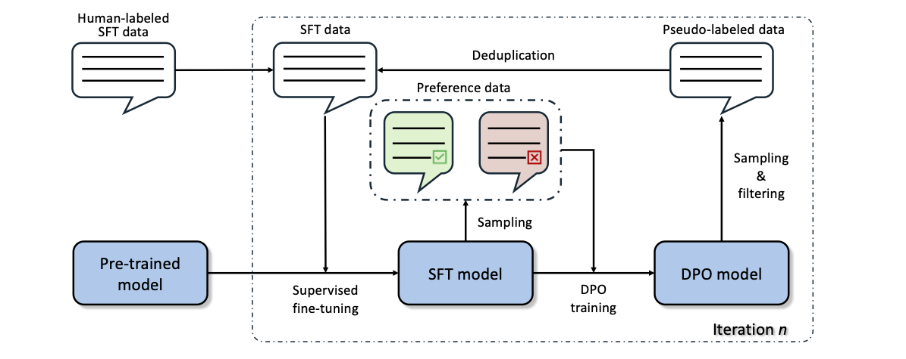

# DPO-ST: DPO-augmented Self-Training

This repository contains the official code and data for the paper **Self-Training with Direct Preference Optimization Improves Chain-of-Thought Reasoning**


## Introduction
Teaching small language models (e.g., T5-large and Llama-2-7b) do chain-of-thought reasoning by distilling from larger models like GPT-4 has become the one of the most effective methods. However, relying on such closed-source and propietry large models can be both computationally and economically costly. Our paper demonstrates that small language models are capable of learning from their own chain-of-thought in a self-training way, starting with limited amount of human-annnotated, high-quality training data. We also provide an effective and efficient way for integrating language models with external calculators during inference to improve the performance. 
<p align="center">
     <br>
    Our approach demonstrates superior performance on the GSM8K benchmark while minimizing the required compute cost 
</p>

## About DPO-ST
**DPO-augmented Self-Training** is built upon the conventional self-training framework. Unlike traditional self-training framework where the pseudo-labels are generated by the SFT models, we add an additional DPO step in each self-training iteration and make pseudo-labels from the DPO model. We empirically found that the DPO models can generate more diverse pseudo-labels with higher quality.
<p align="center">
     <br>
</p>

## Setup
Please follow the following steps before running our code.
1. Use Conda to create a Python virtual environment:
```
conda create -n dpo-st python=3.10
conda activate dpo-st
```
2. Install the Python dependencies with pip.
```
pip install requirements.txt
```
3. Define DATA_DIR in the .env and put pre-trained model checkpoints under it
```
DATA_DIR=${your_directory_for_keeping_pre-trained_models}
```
4. (Optional) provide your Wandb key
```
WANDB_API_KEY=${your_wandb_key}
```

## Citation
If you find this paper useful, please consider citing it
```
@inproceedings{wang2024dpost,
      title={Self-Training with Direct Preference Optimization Improves Chain-of-Thought Reasoning}, 
      author={Tianduo Wang and Shichen Li and Wei Lu},
      year={2024},
      booktitle = {Proceedings of ACL},
}
```

## Acknowledgement
This repo is largely inspired by [GSM8K-ScRel](https://github.com/OFA-Sys/gsm8k-ScRel) and [TRL](https://github.com/huggingface/trl). We are grateful to the authors for their brilliant work.